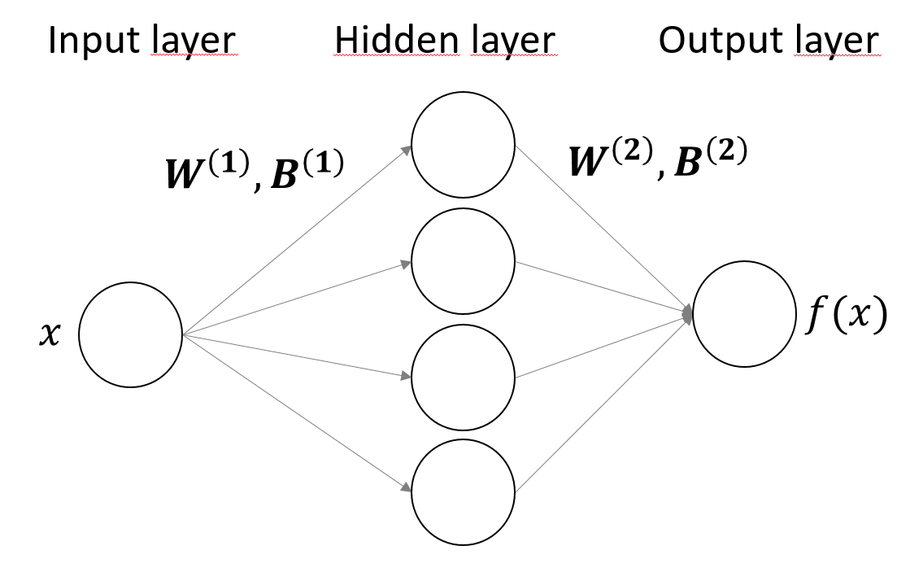

# Machine learning tools to solve the Schrödinger equation

## What is this repository?
It contains the code referred to in this [article](https://arxiv.org/abs/2205.12795). The repository contains a detailed PyTorch implementation of the method of *Neural Quantum States* for three different quantum systems, as a first resource for teaching purposes and also as a guide for those starting in the field. 

## Installation
To install this project in your computer, follow these steps:

1. Clone the repository: `git clone https://github.com/javier-rozalen/ml-tools-for-qm.git`
2. Install the required dependencies: `pip install -r requirements.txt`

## Usage
There are three code files: 
* 1_harmonic_oscillator.ipynb
* 2_double_well.ipynb
* 3_hydrogen_atom.ipynb

They are all in the `.ipynb` format, designed to be open with Jupyter Notebook. 

## Support
If you have any questions or issues, please contact us at jrozalen@ub.edu.
